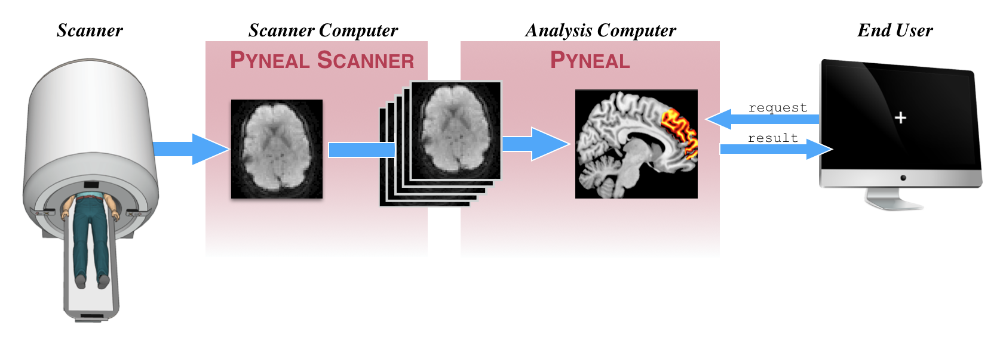

[](https://opensource.org/licenses/MIT)  [](https://travis-ci.com/jeffmacinnes/pyneal)


# Pyneal -- real-time fMRI Analysis Software

**Pyneal** is an open source software package to support real-time functional magnetic resonance imaging (fMRI). It is entirely Python-based and depends exclusively on free, open source neuroimaging libraries.

It allows users to:

* access functional MRI data in real-time
* compute on-going analyses throughout a scan
* monitor data quality
* share analysis results with remote devices (e.g. send results to an experimental task presenting neurofeedback to participants)



It currently supports data formats used across 3 major MRI manufacturers: **GE**, **Siemens**, **Philips**.

In addition to allowing users to compute basic, ROI-based analyses during a scan, **Pyneal** also provides a simple framework for designing and writing customized analyses that can be computed across the whole brain volume at each timepoint.


## Documentation

Please see [**Pyneal Docs**](https://jeffmacinnes.github.io/pyneal-docs/) for full documentation of this package, including:

* Overview
* Installation/Setup
* Usage
* Customizing analyses
* Simulating fMRI environments for testing
* Troubleshooting


## License
Pyneal is licensed under an MIT license. See the [LICENSE](LICENSE.txt) file for additional details.


## Contributors
Thanks for your interest in making this tool better! We welcome your contributions. Below you'll find details that will help organize and structure new contributions.

### Issues

Feel free to submit issues and feature requests via the GitHub page. For tips on formatting your issue submission, please see `ISSUES_TEMPLATE.md` in this same directory

### Contributing Code

Please follow the "fork-and-pull" workflow for submitting your contributions.

1. **Fork** the repo
2. **Clone** the project to your local machine
3. **Commit** changes to your local branch
4. **Push** your changes back to your forked repo
5. Submit a **Pull request** so that we can review changes and incorporate them into the master branch of the repo.

### Testing

Whenever you make changes to the repo, make sure your changes pass the tests on the sample data:

From the top-level directory from the repository, run:

> pytest

If your modifications to the code are successful, you should see output like (truncated for space):

```
Test session starts (platform: darwin, Python 3.6.4, pytest 3.9.3, pytest-sugar 0.9.1)
rootdir: /Users/jeff/gDrive/jeffCloud/real-time/pyneal, inifile:
plugins: xdist-1.23.0, sugar-0.9.1, forked-0.2

 tests/pyneal_scanner_tests/test_GE_sim.py ✓                                                                       3% ▍
 tests/pyneal_scanner_tests/test_GE_utils.py ✓✓✓                                                                  12% █▎
 tests/pyneal_scanner_tests/test_Philips_sim.py ✓                                                                 15% █▌
 tests/pyneal_scanner_tests/test_Philips_utils.py ✓✓✓                                                             24% ██▍
...

Results (8.60s):
      34 passed

```

### Code conventions

To ensure readability and consistency in code stylinh, please use a tool like [flake8](http://flake8.pycqa.org/en/latest/) to ensure your changes conform to PEP8 style guidelines


### Contributor Code of Conduct

As contributors and maintainers of this project, we pledge to respect all people who contribute through reporting issues, posting feature requests, updating documentation, submitting pull requests or patches, and other activities.

We are committed to making participation in this project a harassment-free experience for everyone, regardless of level of experience, gender, gender identity and expression, sexual orientation, disability, personal appearance, body size, race, ethnicity, age, or religion.

Examples of unacceptable behavior by participants include the use of sexual language or imagery, derogatory comments or personal attacks, trolling, public or private harassment, insults, or other unprofessional conduct.

Project maintainers have the right and responsibility to remove, edit, or reject comments, commits, code, wiki edits, issues, and other contributions that are not aligned to this Code of Conduct. Project maintainers who do not follow the Code of Conduct may be removed from the project team.

Instances of abusive, harassing, or otherwise unacceptable behavior may be reported by opening an issue or contacting one or more of the project maintainers.

This Code of Conduct is adapted from the Contributor Covenant, version 1.0.0, available at [http://contributor-covenant.org/version/1/0/0/](http://contributor-covenant.org/version/1/0/0/)


## Acknowledgments
#### Made possible through funding support by:

* **W.M. Keck Foundation**; *awarded to Andrea Stocco, PhD, Chantel Prat, PhD, & Rajesh Rao, PhD*

* **NIMH R01 MH094743**, **Alfred P. Sloan Fellowship**, **Klingenstein Fellowship Award in the Neurosciences**,
**Dana Foundation Brain and Immuno-Imaging Program**; *awarded to R. Alison Adcock, MD, PhD*
