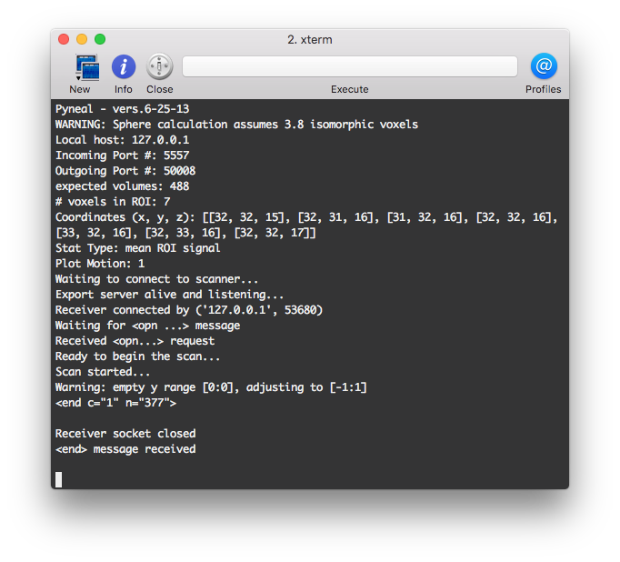
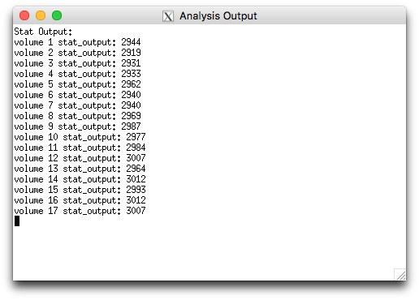
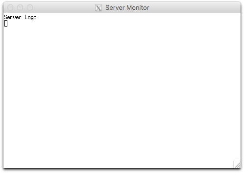
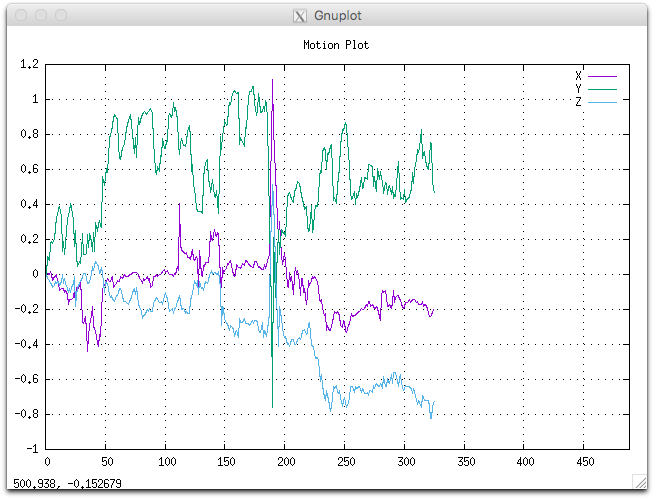
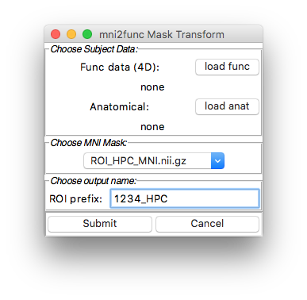
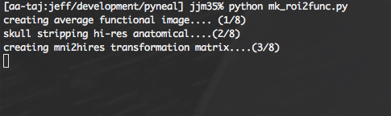
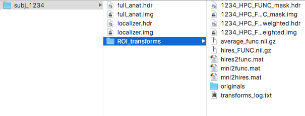
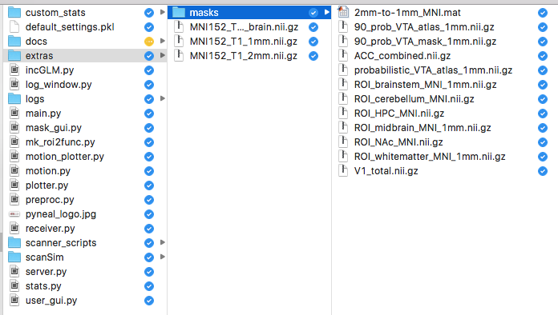
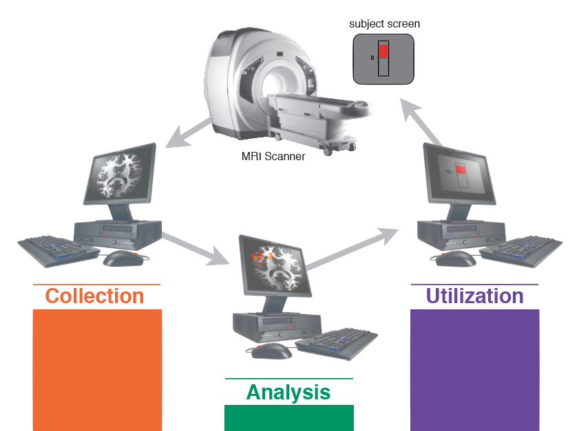
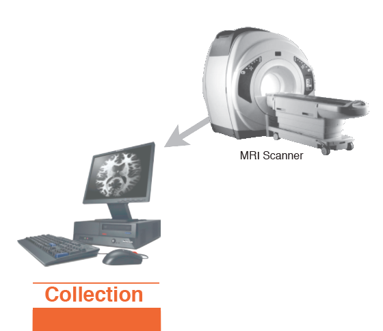

# Pyneal -- real-time fMRI Analysis Software
*updated: 5/2016*

*NOTE:* The current software was built specifically for the scanning environment at Duke University. Over the next few months the code will be adapted to suit more general usage. Along those same lines, the documentation is very much a work in progress. A new software version and complete documentation is anticipated to be released by late summer 2016. Until then, use with caution.

### What is it?
Pyneal is a set of tools written in python for accessing and analyzing fMRI data in real-time. It offers pre-built analysis routines, as well as the option of writing custom code using the provided template and having it execute on each incoming volume. The output of the analysis is hosted via it's own server, allowing experimental presentation software to access the results as needed.

### What's included?
* Pyneal: GUI-based application for interfacing with the scanner and analyzing incoming fMRI data
* Python template for custom analyses, and sample custom analysis scripts
* Script for quickly converting MNI-space mask to subject functional space (requires FSL)
* Sample scanner-side scripts that can be modified to fit different scanner manufacturors and scanning environments
* Sample matlab scripts for interfacing with Pyneal via PsychToolbox experimental presentation
* Sample PsychToolbox code for feedback display

## Guide Organization
The manual has been split up into two sections: Quick Walkthrough, and Detailed Walkthrough. Quick Walkthrough is the basic series of steps/commands to use to run a real-time scan at BIAC. Detailed Walkthrough covers the same ground, but in much greater depth and background in order to better explain why things are set-up the way they are and how its working behind the scenes. 

### Table of Contents
[TOC]

# Quick Walkthrough
This section will provide a quick walkthrough of the steps for running a scan at BIAC5. 

Real-time scanning requires 3 different computers: the scanner console (the machine the techs use to set up the scan), biac5 (formerly Kelvin; the intermediary machine - iMac - used to run Pyneal), and the presentation machine (darwin; the machine you use to present the task).  The steps for each are described below.

## Basic Set-up
### Scanner Console
**when to setup:** *after* the initial localizer scans; *before* any real-time scan

1. Politely ask the tech to allow you to sit at the scanner console for a few moments.

2. Navigate to the the main system settings page. When you first sit down, the console will likely be set to the active scan page. You can get to the main system setting page by clicking on the “tool icon” in the top-left corner of the page. From there, click on the “service desktop manager” tab, and then click on the “c-shell” button twice to open up 2 new terminal shells. 

 One shell will be used to gather information about the ongoing scans, and the other will be used to run the real-time commands.

2. Shell for monitoring scan info:  At the command prompt, type:

	`thisscan`

This is an alias that will navigate to the directory for the current scan session. The localizer scans must have already been completed in order for this step to bring you to the correct place. If “thisscan” is not found for some reason, you can just type the following 3 lines of code manually:

	cd /export/home1/sdc_image_pool/images
	cd `ls -rt1 | tail -1`
	cd `ls -rt1 | tail -1`

This is going to bring you to the most recently created exam directory. Type “pwd” to get the full path of the current directory, and note the specific pXXX and eXXX (where “XXX” is a unique number for each scan session) parent directories.
 
Each scan run during your session is referred to as a “series” and will be saved as a new directory within this exam directory. Series directory names will follow the form “sXXX”. There should already be some individual series directories in here (the localizer scans). 

Type `ls` to see them. 

3. Terminal for executing real-time commands: Navigate to the pyneal scripts directory. At the command prompt type:
	
	`cd /usr/local/packages/pyneal`

This is the directory where the scripts are stored to send data to the real-time analysis machine (biac5; intermediary machine). 

To send an existing, completed scan to biac5, type the command:

	send2kelvin.py

You will be prompted to specify the parent directories (pXXX, eXXX), as well as the unique series directory for the data you want to send. In addition, you’ll also be asked to specify a new name for the transferred files (e.g. MyRun1).  

Next, all of the individual slice files will be collected into a 4d .hdr/.img pair. For large functional runs, this step can take a few minutes. As soon as it is done, it will begin the transfer automatically. You will be prompted for a username and password (must be an existing account on biac5 — likely your netID) to transfer the data to biac5. You’ll have to enter this information twice; once for the .hdr file and once for the .img file. Afterward, it’ll ask if you want to send another series from the same pXXX/eXXX directory. Respond with `y` or `n`. For more information, see **Quick Tasks: Sending data from the scanner to BIAC5**

To send data in real-time to BIAC5, type the command:

	wait4scan.py

Note: before using this command, make sure Pyneal is running on biac5 and is listening for incoming connections. 

You will be prompted to specify the pXXX and eXXX directory names. The script will wait for the scan to start, at which point the new sXXX directory will be created, and incoming data will be sent out the socket connection to BIAC5.
 

### Real-time Machine (BIAC5)
**when to setup:**  *anytime before* the start of the real-time scan. *Before* starting the experimental presentation 

1. Log in to your account on BIAC5 (after kindly asking the techs if its cool to log them out).
2. Open a terminal window, and navigate to the Pyneal directory:

	`cd /path/to/pyneal` **NEEDS UPDATING**

3. Open the Pyneal GUI by typing:

	`python main.py`

This will open the GUI where you can set the options for your scan: 	

**Setting GUI Options**

The options in the GUI will be the same as the last time it was run. So, for your first scan, make sure to go through and set the options carefully. If you have multiple runs in your task, on subsequent runs you can simply open Pyneal and hit **submit**

Alternatively, you can save/load configuration settings by using the File>Save Settings and File>Load Settings options in the menubar. 

*Socket Connections:* Unless something gets reset, these values should always be the same. For more information on socket connections, see the **Detailed Walkthrough**. 

*Preprocessing:* Specify the number of time points in the run. Specify any data preprocessing steps before each volume gets passed to the analysis stage. Current options include Raw Values (i.e. no preprocessing) or Incremental GLM.  The incremental GLM will denoise each volume by fitting the GLM design matrix (of known nuisance regressors) to the data and updating the fit incrementally with every new volume that gets acquired. For more details, see the **Detailed Walkthrough**. 

*ROIs:* Choice of how to define ROIs. Current options include a pre-built mask or defining a spherical ROI. Using a pre-built mask requires you to supply a mask that has been transformed to functional space for this subject. If you’d like to preserve the voxel weightings in the mask, select the “Allow weighting” checkbox. See **Quick Walkthrough:Quick Tasks:ROI Creation on BIAC5** for more information on how to quickly transform an MNI mask to subject functional space. 

Alternatively, you can define a spherical ROI by specifying a center point (x,y,z) in functional space voxel coordinates, and a radius in mm. Note: currently only supports the creation of a single spherical ROI.

*Summary Stats:* Specify the stats you would like to calculate on each volume. Whatever you specify here will be executed once per volume. Options include simple summary measures like the mean and median, which will be calculated using the ROI specified in the prior step. If you selected a Mask ROI and checked the box to allow weighting, the stat calculation will return a weighted average for every volume. 

Alternatively, you can also choose to include a custom stat script. This opens up a number of exciting analysis possibilities. Writing your own custom statistical routines are covered in greater detail in the **Detailed Walkthrough**.

*Misc Options:* Checkboxes for whether you want to write a log file, save the output, and plot motion throughout the run. Log files will contain relevant details pertaining to pyneal settings and the specific run, and will be written to the “logs” subdirectory in the Pyneal directory. Saved output will also be written to the “logs” directory, and will contain the results of the statistical output for every volume in your data. Plotting the motion will allow you to monitor basic X,Y,and Z translations in real-time throughout the scan. 

### Experimental Machine
**when to setup:**  *after* Pyneal has started on the intermediate machine. 

*Tip: Set up your experimental presentation to quickly check the status of the socket connection to the intermediate machine (real-time machine) before starting the task. Pyneal will need to be running already in order to this check to work.*

1. Log in to the experimental presentation machine and open Matlab. Setup any necessary paths, and then navigate to your experimental directory. 

2. The next steps for how to run your task are going to be dependent on what you’re trying to do. In general, you can use the function `getFromServer.m` in your script to request data from the real-time analysis throughout your task. Before the task actually starts, it’s recommended to have `getFromServer.m` request a bogus value from the real-time server, just to ensure the lines of communication are open. For more information on using `getFromServer.m` (as well as some of the options for presenting feedback, see **Detailed Walkthrough**). 

## Quick Tasks
### Starting & Monitoring a Real-time Run
Once you hit submit in Pyneal, a number of windows will pop-up that will allow you you monitor the progress of the scan. As soon as the scanner starts, the information in each of the windows will update as data begins to arrive. Monitoring these windows will let you know if the data collection is proceeding smoothly, and can be used to help troubleshoot/debug any issues that may come up. 

***Main Terminal***

The main terminal window will print out some of the parameters you selected in the GUI (e.g. host/port information for the socket connections, ROI choices, etc). It will also show you the current status of the Receiver server (listening for incoming data from the scanner) and the Export server (listening for incoming requests for analyzed output). If everything is working, before the scan starts you’ll see:

	Waiting to connect to scanner…

and

	Export server alive and listening…

Do not proceed until you see these messages. 

Once the scan begins, this window will show you the connection status between the scanner and Pyneal. Once the connection is made, you’ll see:

	Receiver connected by (‘127.0.0.1’, 12345)
	Waiting for <opn…> message
	Received <opn…> message
	Ready to begin the scan…
	Scan started…

All of these messages will occur in rapid succession. The first line indicates the IP address and port number over which the communication will occur. The next two lines document the start of the complicated handshake between the scanner and the real-time computer that will happen with every slice being sent. For more info, see Detailed Walkthrough: Detailed Overview. 

***Analysis Log window***

As the scan progresses, the Analysis log window will show you the output of whatever stats you've selected to compute on each volume. For instance, if you are calculating the average ROI signal, this window will display the output from each volume as soon as it is calculated. If you notice this window stop updating, chances are something went wrong with your scan/task. 

***Export Server window***

The export window allows you to monitor incoming requests for data from the experimental presentation machine. Each new request will appear in the window, along with the response from the server; if the requested volume’s output exist, that output value will be returned; if not, the server will return an ’N’. 

***Motion window***

The motion window allows you to monitor head motion (translations) along the x,y,and z coordinates throughout the scan. All values are expressed in mm relative to the starting position at timepoint 0. 

***NOTE:*** *THE UNITS ARE CURRENTLY SET TO ASSUME ISOTROPIC VOXELS AT 3.8MM. NO CLEAR WAY HOW TO CALCULATE VOXEL SIZE ON THE FLY YET. FIX IN THE FUTURE*

### Sending Completed Data from Scanner to BIAC5
Real-time runs notwithstanding, there are a number of circumstances where it’s helpful to send data directly from the scanner to the real-time computer (e.g. anatomical data to assist with registration, a localizer run). On the scanner console, open a terminal (see **Basic Set-up: Scanner Console** if you don’t know how to do this), and navigate to the Pyneal scripts directory:

	cd /usr/local/packages/pyneal

To send an *existing, completed* scan (either functional data or anatomical data) to BIAC5, type the command:

	send2kelvin.py

You will be prompted to specify the parent directories (pXXX, eXXX), as well as the unique series directory for the data you want to send. In addition, you’ll also be asked to specify a new name for the transferred files (e.g. MyRun1).  

Next, all of the individual slice files will be collected into a 4D .hdr/.img pair. For large functional runs, this step can take a few minutes. As soon as it is done, it will begin the transfer automatically. You will be prompted for a username and password (must be an existing account on BIAC5 — likely your netID) to transfer the data to BIAC5. You’ll have to enter this information twice; once for the .hdr file and once for the .img file. Afterward, it’ll ask if you want to send another series from the same pXXX/eXXX directory. Respond with `y` or `n`.

On BIAC5, the transferred data will appear in the top level of the experimental directory: 

	/path/to/experimental_directory
	
Copy the transferred files from here into the subject- or study-specific subdirectory to avoid overwriting these files next time you transfer.

***TIPS:***
Functional data are reconstructed and stored on the fly, meaning the individual dicom images representing each slice start appearing in the series directory (pXXX/eXXX/sXXX) as soon as the scan starts. Therefore, you can figure out what the specific sXXX directory is by typing:

	ls -la
	
at any point during the scan and finding the most recently created directory. 

Anatomical images, on the other hand, are only reconstructed and saved after the scan has completed. (might take ~30sec….you can tell by watching the image viewer on the scanner console. As soon as the files are reconstructed, it will quickly play through all slices). The sXXX directory does not get created until after the scan has completed. So, if you’re planning to transfer anatomical images, you’ll have to wait for a few seconds after the scan to make sure the files are ready. 

### Offline Analysis on BIAC5
There are numerous situations where it is necessary to conduct offline analyses in order to set up a real-time task. For instance, if your goal is to provide neurofeedback from a subject-specific functional ROI, you need to collect and analyze a localizer run before beginning any real-time runs. The intermediate machine - biac5 - has a local copy of FSL installed, which can be accessed through the terminal. In addition, the intermediate machine is connected to the BIAC cluster, allowing access to all of the tools installed there as well. 

As soon as you've transferred the required data from the scanner console to biac5, you can do whatever analyses you’d like. However, time is money and there’s a subject getting bored in the scanner, so it pays to be as efficient as possible. Here are some tips:

* Make use of any downtime you can. For example, transfer the required data as soon as you can, even if there’s additional data that needs to be collected before you can start the analysis. Running the anatomicals or a localizer task is a great time to transfer data in the background. You won’t mess up the ongoing scan

* Script everything you can. If you need to check the results of your analysis after it’s completed, write a script that will run your analyses and open the results in FSLview automatically. This saves time, and reduces the potential for mistakes when typing under stress. 

* Anything you can do ahead of time, do. If you’re using FEAT, build a design.fsf file ahead of time, populate it with the timing files (if possible) and have it loaded and ready to go so that you can hit submit as soon as you’ve transferred the data. 

* Open and set-up Pyneal while you're waiting for analyses to finish. 

### ROI Creation on BIAC5 
Pyneal requires that any ROI used during a real-time run be in subject functional space. So, if you have an anatomical ROI in MNI space, say, you must first transform it to subject functional space before Pyneal can load it. 

Pyneal includes tools that will automatically create functional space ROIs from a specified MNI space ROI. A number of MNI space ROIs are included, but it is also possible to add your own (see below). 

In addition to the MNI space ROI, this step also requires 2 additional pieces of data: a high-resolution 3D anatomical image of the subject’s brain, and an example 4D functional image of the subject’s brain, both from the current scan session. Using this data, Pyneal will automatically create the necessary MNI2func transformation matrix (using FSL flirt commands) and apply is to the chosen MNI-space ROI. 

These tools are available in a GUI that can be accessed by navigating to the Pyneal directory in terminal and typing:

	python mk_roi2func.py 

The GUI will pop up and ask you for a number of different inputs. 

Load a functional dataset: Click *load func* to select the functional data to use as the reference for the transformations. The MNI mask will ultimately be transformed down to this functional space. The input functional dataset can be any number of time points (the 4D file will be averaged to create a single 3D reference functional image), so you can either use a localizer task run, or a brief resting state run. For instance, if you're not using a localizer task, simply set up your functional slice prescriptions, run a 20 second resting state run, transfer that data to biac5, and then input it here. 

Load the anatomical image: Click *load anat*  to select the T1 whole brain structural image for this subject. This image will serve as the bridge to go from MNI space down to subject functional space. 

Choose MNI mask: Use the pull down menu to select the MNI-space mask that you’d like to transform. There are a number of mask options in the menu:

However, if you'd like to use a mask not already listed here, you can do this by adding the mask to:

	<pyneal directory>/extras/masks/

Choose output name: Enter the prefix for the output file. This will be prepended to each of the output files that gets created. 

Hit **Submit**. As the transformation proceeds, you will see updates in the terminal window:

The total time will take ~3-5 mins. After it completes, you will be asked (via the terminal) whether you would like to apply this transformation to additional ROIs or not. This allows you to apply the MNI2func transformation matrix you just created to any additional ROIs instead of having to go through the entire set-up again. Type `y` to choose a new MNI space ROI, or `n` to proceed with the original ROI. 

Once the ROI transformation process is complete, the script will automatically load functional space versions of the transformed ROI and the T1 anatomical into FSLview for verification. The transformation process will create two versions of the output ROI: one binarized mask (output: *prefix*  + ‘_mask.hdr/.img) and one non-binarized mask (output: *prefix* + ‘_weighted.hdr/.img). This enables you to preserve any voxel weightings that may have been present in the original ROI (e.g. probabilistic weightings).

All of the output from the transformation process will be written to the s*ame directory as the input functional data*, and stored in a new directory called **ROI_transforms**.

In addition to storing the 2 output ROIs, you will also find the output from each of the transformation steps including the example functional space 3D image, the T1 anatomical in functional space, as well as the transformation matrices representing each step. This is useful if you ever need to go back to recreate this pipeline, or if you’d like to apply the same transformations to new data later on. The original input data is stored in **originals** and you can find the output log for all of the steps in **transforms_log.txt**. 

### Adding New MNI-space ROIs to mk_roi2func.py
As mentioned above, if you don’t see the ROI you want in the pulldown menu of the mk_roi2func GUI, simply place a copy of the ROI (in MNI space) into:

	<pyneal directory>/extras/masks/

***

# Detailed Walkthrough
This section will provide a general overview of how data flows through the various stages during a real-time fMRI scan. This will set the context for understanding the logic behind Pyneal's structure. With each stage, we'll start broad and then narrow the focus to examine sections of the relevant code. 

## Dataflow

To begin, let’s take a broad strokes look at the flow of data during a real-time scanning session. There are 3 stages to any real-time experiment: getting the data, processing it, and doing something with the result. Let’s call those stages Collection, Analysis, and Utilization, respectively.

Note, each stage is depicted with its own workstation, however in practice a single workstation could manage two (or even all, in theory) of the stages on its own. For instance, in a typical MR environment one workstation operates the scanner while another handles the experimental presentation. The experimental presentation workstation could handle the Analysis stage as well, if a third machine isn't available; the stages are merely functional descriptions. That said, there are advantages to a dedicated Analysis workstation, not least of which includes helping to understand the flow of data throughout a scan. Thus, a 3-workstation set-up will be the convention used throughout this manual.

### Collection

This stage is largely the same as it would be under typical, non-real-time, settings. That is, the scanner is sampling and storing the raw BOLD signal periodically throughout the scan. Most relevant to the context of real-time is the *where* and *how* of that process. Most modern day scanners are capable of reconstructing data on the fly, which means that the raw signal is converted from the frequency domain (k-space) to image space as soon as each sample is collected. Each sample constitutes a single 2D slice of brain data (at least under typical functional scanning conditions; each slice in the 3D volume is sampled once per TR). Thus, within milliseconds after sampling, each slice is stored as a unique image file (e.g. DICOM format) on the scanner console. 

In the context of a real-time scan, this stage involves knowing where those images are stored so you can access them while the scan is on-going. By knowing which directory the images are written into, you can monitor for incoming slices and perform any desired operations on that data. In most cases, that will involve sending the data to a separate program for further analysis. In the case of Pyneal, that is exactly the workflow: once a slice dicom file appears in the scan directory, it is converted to binary and sent to Pyneal via socket communication (covered in more detail below). 

Thus, the Collection stage can be thought of as 2 critical processes: monitoring for incoming data, and sending that data to Pyneal once it arrives. 

The details of where – and in what format - incoming data is stored vary based on scanner manufacturer, model, or even the particular computing environment of a scanning facility. Regardless of how or where it is collected, the data needs to be converted to a standard format before it can be used by Pyneal. Therefore, the Collection stage needs to format the incoming data to a standard format before sending to Pyneal. 

When installing Pyneal in a new facility, this is likely the stage that will require the most customization. Some tools are included in the Pyneal distribution, but further modification will likely be needed to fit the idiosyncracies of different environments. 

#### Overview
Throughout a scan, the data must continually get passed along to Pyneal as soon as it is acquired. The specifics of how this happens can vary from facility to facility, and will largely depend on how and where the scanner stores data. Pyneal, on the other hand, expects data to arrive according to a standardized format. The role of the Collection stage is to format the incoming data according to that format and then ship it off to Pyneal. Data sent to Pyneal must be:

1. sent one slice at a time, in sequential order. 
2. preceded by an XML message containing metadata about the slice.

So, the responsibilities of the Collection stage include: Obtaining incoming slice data from the scanner, Formatting an XML header for each slice, and sending the XML header/slice data package to Pyneal.   

#### Obtaining incoming slice data
First off, it's critical to know what happens to the data after the scanner collects it. Depending on the pulse sequence, each slice may be reconstructed from K-space and written to the disk within milliseconds of it being collected; other pulse sequences may wait until the scan has completed and then reconstruct all of the slices at once. If the slices are written to the disk in real-time, you can write a script that will simply monitor the directory they are being written to, and then read and send out each slice as it appears. The story is more complicated if the data are not reconstructed until the end of the scan -- your script will have to access the data in memory, reconstruct it, and then send it out to Pyneal. Writing a script to transform data from K-space to image space is beyond the scope of this manual, so we'll stick with the easier example where files are written to the disk as soon as they are collected. 

***Note:*** *some scanner manufacturers (e.g. Siemens) have recently added support for real-time data servers, which would allow access to data on the scanner via a socket connection throughout the scan, bypassing the step of reading files off of the disk.*

Exactly where on the disk the slice files are written to will vary from scanner to scanner. On the GE system at Duke BIAC, the slice files for a particular scan are stored with the following directory structure:

	[FIXED_PATH]/pXXX/eXXX/sXXX
	
where:

* FIXED_PATH = the parent directories, this part of the path is fixed for all scans
* pXXX = not sure what it stands for, but the XXX part is an unpredictable number
* eXXX = exam directory. Unique for each session. the XXX part is an unpredictable number
* sXXX = series directory. Unique directory for each scan in a session. the XXX part is unpredictable, but after the first scan, the numbers tend to increase in sequence (i.e. s2242 followed by s2243).

Once the subject is setup in the scanner, the first couple of localizer scans will establish the pXXX/eXXX directories. You can find these directories by opening up a terminal and typing:

	cd [FIXED_PATH]
	cd `ls -rt1 | tail -1`
	cd `ls -rt1 | tail -1`
	pwd

This will first take you to the [FIXED_PATH] directory, then into the most recently modified pXXX directory, then the most recently modified eXXX directory. Then it will echo the complete full path to the command window, allowing you to note the specific *p* and *e* values. 

As soon as each new scan begins, a new sXXX directory will appear, and the individual slice files are written within. It is the task of your code to send the slice data to Pyneal according to the format described in the next section.

#### Formatting XML header
XML messages are used to communicate information about the progress of the scan, and incoming slice information. 

**Open message:** The start of the scan is marked by an OPEN message sent to Pyneal, initiating the session and telling Pyneal about the size of the incoming data set. The XML header must take the form of:

	<opn x="64" y="64" z="32"/>
	
where:

* *x* = number of voxels in x-dimension of each slice
* *y* = number of voxels in y-dimension of each slice
* *z* = number of slices in each 3D volume

Any additional fields included in the XML open message are currently ignored. As soon as Pyneal receives the OPEN message, it responds back with an acknowledge message, indicating Pyneal is ready to begin receiving slice data. The reply takes the form:

	<ack x="64" y="64" z="32"/>

**Slice messages:** The data for each slice is preceded by an XML header containing metadata about the particular slice. The XML header for slice data must take the form:

	<rec L="00037" v="1" z="1" n="8192"/>

where:

* *L* = size in bytes of the current XML header (i.e. number of total characters)
* *v* = volume number associated with current slice
* *z* = slice number (within volume) of the current slice
* *n* = size of the slice in bytes

This XML message serves a couple of important roles. The *v* and *z* fields tell Pyneal where to assign each particular slice as it builds up a 4D matrix throughout the course of the scan. 

The *L* field serves an important, if confusing, role. Each time Pyneal receives a message, it has to know how long that message will be. However, the length of each slice's XML header will vary based on the the volume and slice numbers. For instance, the XML header for volume 1 will be 2 characters shorter than the XML header for volume 100. To solve this problem, Pyneal reads the header in 2 bursts. Initially, it only reads the first 14 characters. Since the *L* field value is padded with zeros, the first 14 characters will always encompass the entirety of that message. The *L* field indicates to Pyneal how many *more* characters to expect in the current header, which allows Pyneal to get the entirety of the remaining header on the second read. In this manner, Pyneal can get the complete header for each slice.

The *n* field tells Pyneal how much data to expect when receiving the slice. It is a way for Pyneal to verify it has received the complete slice before continuing on to the next step. Assuming each voxel in the slice is represented by an unsigned 16-bit (i.e. 2 byte) integer, the total size of each slice (in bytes) can be calculated as:

	(number of voxels in x-dimension) * (number of voxels in y-dimension) * 2 
	
As Pyneal receives the actual slice data, it sends back an XML header of the form:

	<ack L="00037" v="1" z="1" n="8192"/>

where now the *n* field represents how many bytes of the slice Pyneal has successfully received. If all of the data has been received, the *n* fields will match between the `<rec>` and `<ack>` messages; if not, the scanner knows what portion of the data did not make it. Pyneal will keep listening until it receives all of the data that it expects for this slice. In practice, the entirely of each slice is almost always sent in one pass.  

Again, any additional fields included in the XML header for each slice are currently ignored.  

**End message:** After the scan has completed and all of the data has been sent to Pyneal, a final XML message is sent indicating the end of the scan. This END message takes the form:

	<end n="300"/>

where:

* *n* = the total number of volumes sent (not to be confused with the *n* field of the slice XML headers)

Pyneal, in return, will send an acknowledgment of the form:

	<ack n="300"/>

where:

* *n* = the total number of volumes *received*

Once the end message is received, Pyneal stops listening for new data, and the communication port (described below) is closed. 
 

#### Sending 

## Preprocessing & Analysis Options
### Preprocessing Using an Incremental GLM
### Building Custom Analysis Routines

## Intergrating Real-time Output with PsychToolbox 
### Overview
### Accessing Data with getFromServer.m
### Sample Feedback Displays

***

# Troubleshooting
### What happens if I get an error that says socket address is already in use?
### What happens if I have to stop the scan prematurely?

